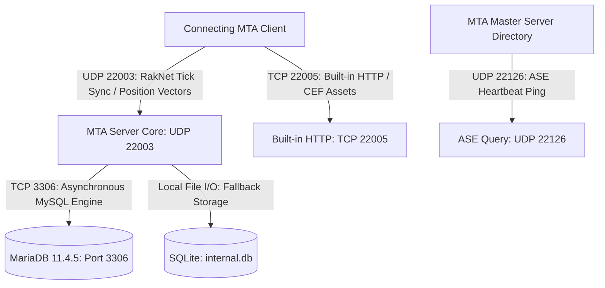

# Dossier 02: Engine, Networking & Database Infrastructure
**Project**: Mzansi-ZA Roleplay Environment  
**Analysis Standard**: Zero-Temperature Infrastructure & Systems Dissection  
**Primary Config**: `server/mods/deathmatch/mtaserver.conf`  
**Database Backend**: MariaDB 11.4.5 (`E:\mariadb-11.4.5-winx64`) & SQLite (`mods/deathmatch/internal.db`)  

---

## 1. Network Topology & Port Architecture

The server operates on the hybrid UDP/TCP architecture native to the MTA:BLUE core:



### Empirical Port Audit

| Port | Protocol | Setting in `mtaserver.conf` | Recommended Production Setting | Current Status |
| :--- | :--- | :--- | :--- | :--- |
| **Game Sync** | UDP | `<serverport>22003</serverport>` | `22003` | **Correctly configured** |
| **HTTP / WebAdmin**| TCP | `<httpport>22005</httpport>` | `22005` | **Correctly configured** |
| **ASE Query** | UDP | `<ase>1</ase>` (Calculates to 22126) | `1` | **Broadcasting enabled** |
| **LAN Broadcast** | UDP | `<donotbroadcastlan>0</donotbroadcastlan>` | `0` | **Local discovery active** |
| **HTTP Streaming**| TCP | `<httpdownloadurl></httpdownloadurl>` | `http://cdn.mzansi-rp.co.za/resources/` | **Blank (Falls back to internal HTTP engine)** |

---

## 2. Low-Latency Synchronization Parameter Audit

The `The Mzansi-ZA Technical Compendium` and `MTA San Andreas Server Setup.md` dictate precise parameters to ensure low double-digit latency for competitive combat and vehicle physics.

### Discrepancy Matrix

```
Current Configuration (mtaserver.conf):
  Line 134: <bandwidth_reduction>medium</bandwidth_reduction>   <-- Culls vital updates
  Line 140: <player_sync_interval>100</player_sync_interval>     <-- 10 Hz tick rate
  Line 142: <lightweight_sync_interval>1500</lightweight_sync_interval>
  Line 144: <camera_sync_interval>500</camera_sync_interval>
  Line 146: <ped_sync_interval>400</ped_sync_interval>
  Line 150: <unoccupied_vehicle_sync_interval>400</unoccupied_vehicle_sync_interval>

Mandated Production Configuration:
  <bandwidth_reduction>none</bandwidth_reduction>               <-- Zero culling for custom meshes
  <player_sync_interval>50</player_sync_interval>               <-- 20 Hz tick rate (High-fidelity)
  <lightweight_sync_interval>1500</lightweight_sync_interval>
  <ped_sync_interval>200</ped_sync_interval>                    <-- Smoother NPC movement
  <unoccupied_vehicle_sync_interval>200</unoccupied_vehicle_sync_interval>
```

> [!WARNING]
> Setting `bandwidth_reduction` to `medium` will cause custom 3D vehicles (e.g. Toyota Quantum minibuses) and custom mapped objects to flicker or desynchronize for remote players during high-speed chases. It MUST be set to `none`.

---

## 3. Database Layer: The Synchronous Blocking I/O Anti-Pattern

### 3.1 The Physical Engine
The launcher script `server/START_SERVER.bat` starts a dedicated standalone MariaDB instance:
- Executable: `E:\mariadb-11.4.5-winx64\bin\mysqld.exe`
- Data directory: `E:\mariadb-11.4.5-winx64\data`
- Port: `3306`, bound to `127.0.0.1`

### 3.2 The Blocking I/O Defect
In `server/database.lua` (replicated in 12 resources), queries are implemented as follows:
```lua
-- File: server/database.lua (Line 256-264)
function Mzansi.Database.query(sql, ...)
    Mzansi.Database.lazyConnect()
    if not Mzansi.Database._pool then
        outputDebugString("[Mzansi-DB] No database connection!", 1)
        return nil
    end
    local result = dbPoll(dbQuery(Mzansi.Database._pool, sql, ...), -1) -- <-- FATAL BLOCKING CALL
    return result
end
```
**Why this breaks the server:**
In MTA:SA, `dbPoll(handle, -1)` specifies an **infinite blocking timeout**. The entire C++ game server thread stops processing player movement, vehicle physics, and network packets until MySQL responds. If MySQL is under I/O load, every player on the server experiences a sudden freeze ("micro-stutter" or "frame hitch").

### 3.3 The Single Point of Failure (No SQLite Resilient Fallback)
If MariaDB is not started (e.g., if a developer launches `MTA Server.exe` directly rather than running `START_SERVER.bat`), `dbConnect("mysql", ...)` fails:
```lua
Mzansi.Database._pool = nil
```
There is **zero fallback** to SQLite. Consequently, all 12 resources fail silently or throw nil indexing errors whenever an account registers, logs in, or saves data.

### Required Architectural Remedy: Sovereign Dual-Engine DB Manager
1. Implement a single, central database manager in `mzansi_core`.
2. Automatic connection fallback: Try MySQL/MariaDB first $\rightarrow$ if unavailable, immediately fallback to local SQLite (`internal.db` or `mzansi_local.db`).
3. Replace blocking `dbPoll(..., -1)` with asynchronous callbacks:
   ```lua
   dbQuery(callbackFunction, {player}, dbPool, sql, ...)
   ```
4. Export all database methods via `exports.mzansi_core:*` so that child resources do NOT maintain separate database connection pools.

---

## 4. Software Aging & Angel Worker Architecture

In accordance with the **Angel Terminology Standard**:
- All recurring timers, maintenance workers, and background monitoring tasks are designated as **Angels**.

### Identified Angel Workers in Mzansi-ZA:
1. **Emergency Mission Dispatch Angel**: Runs every 180 seconds in `activity_system.lua:377` generating dynamic 911 emergencies (robberies, EMS rescues, hostage situations).
2. **Dynamic Ambient Traffic Angel**: Runs every 45 seconds in `activity_system.lua:381` culling distant vehicles and spawning local ambient cars.
3. **Territory War & Gang Skirmish Angel**: Runs every 300 seconds in `activity_system.lua:385` generating rival gang clashes.
4. **Civilian Event Angel**: Runs every 240 seconds in `activity_system.lua:389` triggering street incidents.
5. **Vehicle Fuel Consumption Angel**: Runs on a 1-second interval timer per client in `vehicles_client.lua:12`.
6. **Payday Angel**: Runs every 3,600,000 ms (1 hour) in `jobs.lua:19` dispensing faction and career salaries.

### Mitigating Software Aging
Long-running MTA servers on 32-bit RenderWare architectures suffer from memory fragmentation beyond ~1.2GB of RAM. An automated **Maintenance Angel** must be added to `mzansi_core` that executes a scheduled cleanup cycle during off-peak hours (e.g., 04:00 AM SAST), purging inactive element data, running `compact_internal_databases`, and restarting resources to flush memory leaks.
