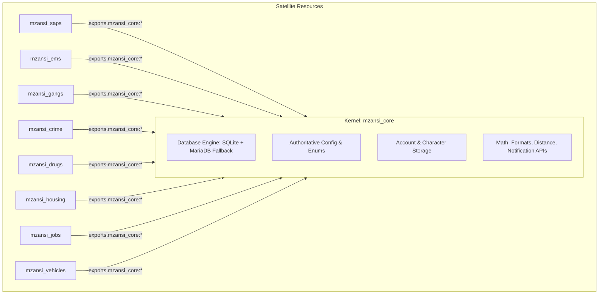

# Dossier 03: Codebase Architecture & Duplication Analysis
**Project**: Mzansi-ZA Roleplay Environment  
**Audit Standard**: Polyglot Static Analysis & Lua State Topology  
**Target Scope**: 16 Active Resources in `server/mods/deathmatch/resources/`  
**Total Analyzed Lines**: 26,476 lines of Lua across 108 files  

---

## 1. High-Level Architectural Anatomy

The server's code is partitioned across 16 resource folders in `server/mods/deathmatch/resources/`:

```
server/mods/deathmatch/resources/
├── mzansi_core/          [Kernel: Database, Auth, Characters, Vehicles, NPCs, Missions, Dashboard]
├── mzansi_utils/         [Orphaned Utility Functions - 0 exports in meta.xml]
├── mzansi_anticheat/     [Speed, Teleport, Health, Weapon Checkers]
├── mzansi_hud/           [DirectX Speedometer & Compass]
├── mzansi_vehicles/      [Client Fuel/Damage/Lock Controls - Missing Server Logic]
├── mzansi_inventory/     [Item Management & Semi-CEF Interface]
├── mzansi_phone/         [Smartphone UI: Calls, SMS, Banking, Contacts]
├── mzansi_housing/       [Real Estate: Buy, Rent, Lock, Enter, Exit]
├── mzansi_jobs/          [Employment: Trucking, Taxi, Fishing, Payday]
├── mzansi_saps/          [Police: Cuff, Arrest, Ticket, Frisk, Dispatch, MDT]
├── mzansi_ems/           [Medical: Heal, Revive, Ambulance Load]
├── mzansi_gangs/         [Territory Wars, Graffiti Spraying, Gang Treasury]
├── mzansi_crime/         [Store Robbery, Heists, Illegal Jobs, Black Market]
├── mzansi_drugs/         [Planting, Harvesting, Drug Effects, Trafficking]
├── mzansi_illegalmarket/ [Fencing, Chop Shop, Black Market Dealer]
└── mzansi_maps/          [EMPTY: 0 map files, 0 custom objects]
```

---

## 2. The 15,000-Line Duplication Anti-Pattern

In MTA:SA, every resource executes in an isolated Lua virtual machine. Scripts in `mzansi_saps` cannot access global tables in `mzansi_core` unless functions are exported via `meta.xml`.

Instead of utilizing an authoritative export architecture, the codebase suffers from **massive copy-paste duplication**. Identical library files were physically pasted into almost every single resource directory:

| Replicated File | Copies | Total Lines | Identical MD5 Hash Across Replicas | Impact & Hazards |
| :--- | :--- | :--- | :--- | :--- |
| `server/database.lua` | **12** | 6,660 lines | `2dc8b94ca8da2ca99947b41fadc54afe` | 12 separate resources each open their own MariaDB connections, each execute 15 redundant `CREATE TABLE` queries on startup, and each consume duplicate socket handles. |
| `shared/config.lua` | **13** | 3,432 lines | `321e9be9...` | Changing a server setting (e.g. `defaultCash` or `payInterval`) requires editing 13 separate files! |
| `shared/enums.lua` | **13** | 1,378 lines | `1d5acf30...` | Adding a new job or faction ID requires updating 13 separate files or causes desync. |
| `shared/util.lua` | **13** | 3,900 lines | Divergent across 3 versions (`b726`, `4341`, `2659`) | Features added to `core/shared/util.lua` do not exist in `phone/shared/util.lua`. |
| `server/characters.lua` | **12** | 1,250 lines | Divergent across 3 versions | `core` has the real 337-line implementation; 10 resources have a 92-line bridge; `phone` has an incomplete 2-line stub! |

### Mathematical Impact
- Total Lua codebase size: **26,476 lines**.
- Redundant duplicated code: **~15,370 lines** (58% of the entire server's Lua codebase is pure duplication!).
- Memory footprint: The MTA server loads and compiles 12 duplicate copies of the database schema and utility libraries into client and server RAM.

---

## 3. The `mzansi_utils` Resource Paradox

`server/mods/deathmatch/resources/mzansi_utils/` was created to house shared utilities:
```xml
<!-- File: mzansi_utils/meta.xml -->
<meta>
    <info author="Mzansi Development Team" name="mzansi_utils" description="Utility Functions" version="1.0.0" type="script" />
    <script src="shared/utils.lua" type="shared" />
</meta>
```
However:
1. `meta.xml` defines **ZERO `<export>` tags**.
2. Because no exports exist, neither server-side nor client-side scripts in other resources can call `exports.mzansi_utils:formatCurrency(...)`.
3. Consequently, `mzansi_utils` is a completely dead, isolated resource that executes in memory but provides no value to the rest of the ecosystem.

---

## 4. The Architecture Solution: Kernel-Module Decoupling

To eliminate the 15,000-line duplication and ensure seamless, bulletproof maintenance:



### Decoupling Rules
1. **Single Source of Truth**: All database operations and core account/character state must reside exclusively in `mzansi_core`.
2. **Delete Duplicated Files**: Remove `server/database.lua` and `shared/config.lua` from the 11 satellite resources.
3. **Standardized Bridges**: Ensure satellite resources use a clean, lightweight bridge table that forwards calls to `exports.mzansi_core:*` with nil safety guards.
