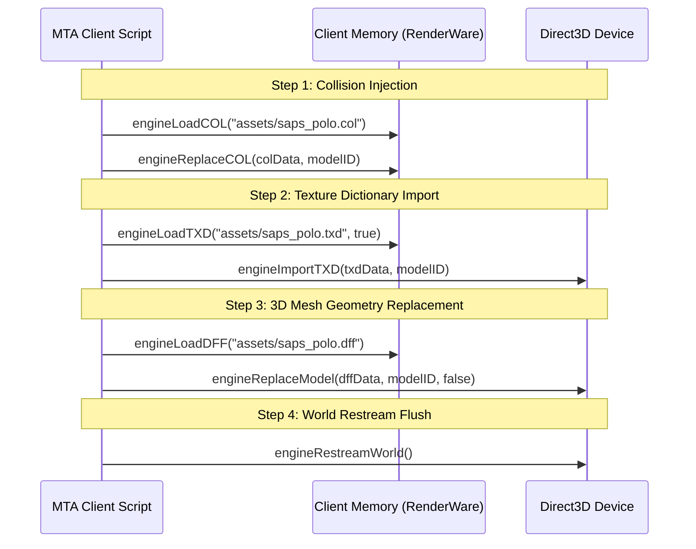

# Dossier 08: Asset Pipeline & Cultural Localization
**Project**: Mzansi-ZA Roleplay Environment  
**Audit Standard**: 3D Asset Geometry, Audio Soundscapes & Cultural Realism  
**Target Subsystems**: `mzansi_maps`, `mzansi_assets`, 3D Models (`.dff`, `.txd`, `.col`), Audio  

---

## 1. Executive Summary & The Asset Void

The strategic vision documents (`MTA-SA-Mzansi-ZA.md` and `MTA San Andreas Server Setup.md`) place supreme emphasis on **visual and cultural authenticity**:
- Commuter fleets: Toyota Quantum minibus taxis, local commuter buses.
- Law enforcement fleets: SAPS Volkswagen Polo, BMW 3-Series interceptors, Metro Police cruisers.
- Built environment: SAPS station architecture, township spaza shops, informal settlements, regional highway signage (N1, N3, R101 markers).
- Character skins: SAPS tactical uniforms, paramedic scrubs, private security guards (G4S / ADT).

However, an exhaustive search across the entire server directory reveals:
- **Total Custom 3D Model Files in Server Resources**: **0** (Zero `.dff`, `.txd`, or `.col` files exist in any active resource).
- **`mzansi_maps` Resource**: Contains only a 4-line `meta.xml` with **0 map files, 0 custom objects, and 0 interior definitions**.
- **`_OLD_mzansi_backup/mzansi_assets`**: Contains empty subdirectories (`buildings`, `skins`, `vehicles`) with no binary files.
- **Audio Assets**: Zero custom audio files (`.mp3`, `.ogg`, `.wav`) exist in the project.

Currently, the server runs purely on vanilla 2004 Grand Theft Auto: San Andreas models (American police cruisers, generic yellow cabs, and California street signs).

---

## 2. The Mandated Cultural Asset Import Pipeline

The vision documents establish the exact sequential API sequence required to inject South African assets into the legacy RenderWare engine without memory leaks:



### Dynamic Model Allocation vs. Direct Slot Replacement
To avoid replacing base game vehicle slots (IDs 400 to 611) or ped slots (IDs 7 to 312), the engine supports:
```lua
local dynamicID = engineRequestModel("vehicle", 426) -- Based on Premier
engineReplaceCOL(colData, dynamicID)
engineImportTXD(txdData, dynamicID)
engineReplaceModel(dffData, dynamicID)
```
And to prevent memory leaks during resource reloads:
```lua
addEventHandler("onClientResourceStop", resourceRoot, function()
    engineFreeModel(dynamicID)
end)
```

---

## 3. The Blueprint to Transform the Built Environment (`mzansi_maps`)

`mzansi_maps` must be transformed from an empty stub into an atmospheric South African urban landscape:

### 3.1 Priority Mapping Areas
1. **Pershing Square $\rightarrow$ SAPS Central Command**:
   - Perimeter security barriers, razor-wire fencing, electronic sliding boom-gates.
   - SAPS helipad markings and tactical vehicle parking bays.
   - Holding cell interior / booking desk checkpoint.
2. **Commerce $\rightarrow$ The Great Taxi Rank**:
   - Metal corrugated roofing shelters, raised passenger platforms, and queue railings.
   - Taxi rank marshals' booth with loud-hailer props.
   - Informal street stalls: Braai meat drums, fruit crates, fold-out tables with airtime cards.
3. **East Los Santos & Ganton $\rightarrow$ Township Kasi Atmosphere**:
   - Spaza shop facades with vibrant hand-painted signage (Coca-Cola, MTN yellow, Vodacom red).
   - Tire repair shops ("Puncture Repaired Here"), shipping containers repurposed as hair salons.
   - Gang territory perimeter graffiti tags and murals.
4. **Highway Corridors (Los Santos Freeways)**:
   - Highway gantry overhead signs with custom textures: **N1 North (Pretoria / Polokwane)**, **N3 South (Durban / Pietermaritzburg)**, **M1 South (Johannesburg CBD)**.

---

## 4. The Sonic Soul of Mzansi: 3D Spatial Audio

To truly bring the world alive, sound is as critical as 3D geometry:

1. **Township Spaza Soundscapes**:
   - Utilize `playSound3D` attached to spaza shop markers playing looping Amapiano / Kwaito beats with gentle low-pass distance filtering.
2. **Taxi Rank Ambience**:
   - Spatial audio triggers at the Commerce taxi rank with authentic route calls:
     *"Noord! Noord! Bree! Soweto! Rank 4 moving now!"*
3. **SAPS Emergency Sirens**:
   - Replace the generic American wail with the distinctive South African dual-tone European-style police siren when officers toggle sirens.
4. **NPC Voice Reactions**:
   - When players press `[E]` near NPCs, play localized voice greeting audio clips (Zulu, Xhosa, Sotho, Afrikaans, English).
