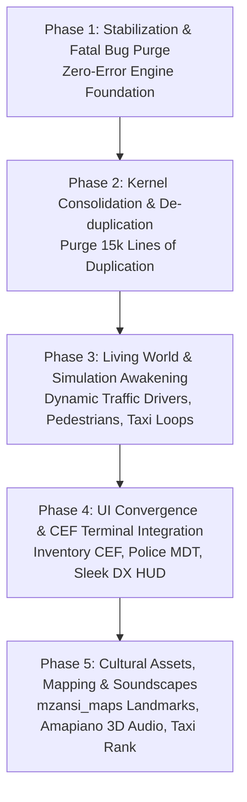

# Dossier 09: Master Completion Plan & Awakening Roadmap
**Project**: Mzansi-ZA Roleplay Environment  
**Synthesis Standard**: Sovereign Systems Convergence Blueprint  
**Goal**: Transform the codebase from fragmented stubs into an elite, living South African MMO world  

---

## 1. Executive Summary & Convergence Matrix

Our exhaustive deep research dissection analyzed 26,476 lines of Lua, 5 strategic doctrine documents, 16 resource packages, and empirical runtime execution logs. We uncovered:
- **10 Fatal Runtime Crash Vectors** that currently break anticheat, police actions, medical revives, housing, gang territory conquest, and account registration.
- **15,000+ Lines of Redundant Code Duplication** across 12 resources causing memory bloat and maintenance sync failures.
- **A Total Asset & Mapping Void** where 0 custom 3D models and an empty map resource exist despite extensive documentation.
- **A Frozen Simulation** where 70+ beautifully conceptualized South African NPCs are frozen in place and ambient traffic is completely driverless.
- **A Disconnected UI Architecture** with orphaned CEF HTML5 assets and crashing DX scripts.

Below is the **Master 5-Phase Awakening Plan** designed to surgically repair, streamline, and bring the Mzansi-ZA world to life.

---

## 2. The 5-Phase Master Awakening Plan

---

### Phase 1: Stabilization & Fatal Bug Purge (Zero-Error Engine Foundation)
*Objective: Eliminate all runtime errors from `server.log`, secure authentication, and prevent thread freezes.*

1. **Global Utility Fixes**:
   - Define `getElementSpeed(element, unit)` globally in `shared/util.lua` to immediately stop the 6-second anticheat error spam in `server.log` and fix the client HUD speedometer.
2. **Multi-Return Lua Truncation Repair**:
   - Replace all 12 broken `Mzansi.Util.distance(getElementPosition(...))` calls in SAPS, EMS, Gangs, Housing, and Crime with MTA's native C++ `getDistanceBetweenPoints3D()`.
   - Restore functional police cuffs, arrests, tickets, frisks, medic heals, house entries, and gang turf claims.
3. **AI Skirmish Server-Side Fix**:
   - Replace the client-only `setPedTarget` call in `activity_system.lua:597` with server-side `setPedAimTarget` and weapon control states.
4. **Authentication Upgrade to BCrypt**:
   - Replace the non-existent `hash("sha256", ...)` in `accounts.lua` with MTA's native `passwordHash(pass, "bcrypt")` and `passwordVerify()`.
5. **Authoritative Vehicle Refueling**:
   - Move client-side `removeCash` in `vehicles_client.lua` to a secure server-authoritative event `mzansi:vehicles:refuel`.
6. **Housing Interior & Exit Teleport Fix**:
   - Assign authentic GTA SA interior coordinates for each house type and record the entry property ID on the player element to prevent teleporting into the ocean void.
7. **Database Thread Unblocking & SQLite Auto-Fallback**:
   - Replace blocking `dbPoll(..., -1)` with asynchronous callbacks.
   - Implement resilient automatic failover: Attempt MariaDB (3306) $\rightarrow$ if offline, seamlessly fall back to local SQLite (`internal.db` or `mzansi_local.db`).
8. **Network Performance Tuning**:
   - In `mtaserver.conf`, update `<bandwidth_reduction>` from `medium` to `none` and `<player_sync_interval>` from `100` to `50`.

---

### Phase 2: Kernel Consolidation & Architecture De-duplication
*Objective: Transform `mzansi_core` into an authoritative engine kernel and purge 15,000 lines of copy-paste bloat.*

1. **Kernel Centralization**:
   - Establish `mzansi_core` as the single authoritative manager for Database Connections, Account/Character persistence, Configuration, and Shared Utilities.
2. **Purge Satellite Duplication**:
   - Remove the redundant copies of `server/database.lua` and `shared/config.lua` from the 11 satellite resources.
   - Standardize `server/characters.lua` into a clean, lightweight export bridge across all resources.
3. **Activate `mzansi_utils`**:
   - Add `<export>` tags to `mzansi_utils/meta.xml` for `formatCurrency`, `getTimestamp`, `date`, `tableLength`, and `randomString`.
4. **ACL Security Hardening**:
   - Update `mods/deathmatch/acl.xml` to grant appropriate database and resource management privileges to the `mzansi_*` resource suite.

---

### Phase 3: Living World & Simulation Awakening
*Objective: Elevate Los Santos into a breathing South African city with moving life, active transit, and dynamic emergency response.*

1. **Dynamic Ambient Traffic with Drivers**:
   - Update `activity_system.lua:spawnDynamicTraffic` to create an NPC driver ped inside every spawned vehicle and set `setPedControlState(driver, "accelerate", true)`.
2. **Dynamic Pedestrian Life**:
   - Unfreeze a selection of street pedestrians in high-density corridors (Pershing Square, Commerce, Market, Ganton).
   - Implement simple pedestrian waypoint paths so civilians walk between stores, bus stops, and street vendors.
   - Add panic flee animations (`PED`, `cower`) when gunshots or explosions occur near NPCs.
3. **The Minibus Taxi Transit Engine**:
   - Implement passenger queue spots at the Commerce Taxi Rank and township stops.
   - When a player driving a taxi stops at a rank, NPC peds walk up, enter the side passenger seats, specify a destination, and pay the player in Rands upon arrival.
4. **Autonomous SAPS Patrol Angel**:
   - Spawn a marked SAPS cruiser with two officer peds that cruises along a patrol route between Pershing Square, Idlewood, and Ganton.
   - If an active robbery occurs, the patrol cruiser toggles emergency lights and routes toward the incident.

---

### Phase 4: UI Convergence & CEF Terminal Integration
*Objective: Resolve the CEF vs. DX conflict, deliver the missing Police MDT, and modernize the in-game HUD.*

1. **Player Inventory CEF Awakening**:
   - Declare `ui/inventory.html` properly in `mzansi_inventory/meta.xml` (`<file>` and `<html>`).
   - Replace the broken `createBrowser()` pattern in `inventory_client.lua` with a working CEF browser window using `executeBrowserJavascript`.
2. **Police Mobile Data Terminal (MDT)**:
   - Create the missing `mzansi_saps/ui/mdt.html` with a modern South African Police Service theme.
   - Include searchable tabs for: Citizen Criminal Records, Active Warrants, Vehicle Plate Lookups, and 911 Emergency Dispatch logs.
3. **Polished DirectX Heads-Up Display**:
   - Fix `hud_client.lua` to render a crystal-clear speedometer needle, digital km/h readout, fuel percentage bar, and mini-map compass without nil errors or parameter glitches.

---

### Phase 5: Cultural Assets, Mapping & Soundscape Awakening
*Objective: Immerse the player in South African culture through architecture, 3D models, and street soundscapes.*

1. **Township & Urban Landmark Mapping (`mzansi_maps`)**:
   - Build out the Commerce Taxi Rank: add raised metal platform shelters, taxi parking lanes, queue railings, and street food stalls.
   - Add SAPS Station compound security: boom gates, guard booths, and tactical vehicle bays.
   - Add township spaza shop facades in East Los Santos and Ganton with iconic branding (Coca-Cola, MTN, Vodacom, local barbershop signs).
   - Place highway overhead signage markers for the N1, N3, and M1 routes.
2. **3D Asset Pipeline Integration (`mzansi_assets`)**:
   - Scaffold a dedicated resource `mzansi_assets` implementing the `COL -> TXD -> DFF` pipeline with `engineRequestModel` and `engineFreeModel`.
   - Prepare model replacement slots for:
     - Model 420 (Taxi) $\rightarrow$ Toyota Quantum Minibus Taxi.
     - Model 426 (Premier) $\rightarrow$ SAPS Volkswagen Polo / BMW 3-Series Cruiser.
     - Model 416 (Ambulance) $\rightarrow$ South African Emergency Services Ambulance.
3. **3D Spatial Street Soundscapes**:
   - Attach `playSound3D` nodes at spaza shops playing looping Amapiano / Kwaito tracks with realistic distance attenuation.
   - Add ambient taxi marshal shout audio at the Commerce rank.
   - Add localized voice greetings in Zulu, Xhosa, Sotho, and Afrikaans when interacting with NPCs via `[E]`.
