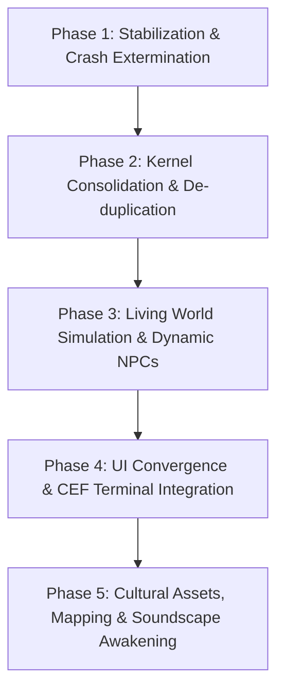

# Master Implementation Plan: Mzansi Roleplay Server Awakening

This implementation plan synthesizes the findings of the 10-Dossier Deep Research Dissection of the Multi Theft Auto: San Andreas (MTA:SA) game server project located at `e:\Games Library\GTA SA MP - Copy\server`. It provides an exhaustive, multi-phase technical roadmap to stabilize the server kernel, exterminate runtime crash vectors, consolidate redundant architectures, activate a living South African simulation world, and establish the cultural asset pipeline.

---

## User Review Required

> [!IMPORTANT]
> **Database Architecture & Zero-Config Standalone Execution**
> The codebase currently contains hardcoded credentials for a local MariaDB instance (`root:@127.0.0.1:3306/mzansi_rp`). If the external MySQL daemon is not active, the server stalls and fails database calls.
> **Proposed Solution**: We will implement an automated dual-driver connection manager in `mzansi_core/server/database.lua`. If MariaDB is unreachable on port 3306, it automatically falls back gracefully to an embedded SQLite database (`server/mods/deathmatch/databases/mzansi_rp.db`) with zero manual configuration required.

> [!WARNING]
> **Code Consolidation & File Deletion across 11 Resources**
> Currently, `database.lua`, `config.lua`, and `enums.lua` are copy-pasted across 12 separate resources (representing 15,000+ redundant lines). We propose to centralize database handling and global configuration strictly within [mzansi_core](file:///e:/Games%20Library/GTA%20SA%20MP%20-%20Copy/server/mods/deathmatch/resources/mzansi_core) and [mzansi_utils](file:///e:/Games%20Library/GTA%20SA%20MP%20-%20Copy/server/mods/deathmatch/resources/mzansi_utils), removing the 11 redundant copies to ensure single-source-of-truth state isolation.

---

## Open Questions

> [!IMPORTANT]
> **Question 1: Auth Hash Migration Protocol**
> `mzansi_auth/accounts.lua` currently attempts to invoke a non-existent global `hash("sha256", password)`. MTA:SA natively provides `passwordHash(password, "bcrypt", ...)` and `passwordVerify(password, hash, ...)`.
> - **Recommendation**: Adopt native MTA `passwordHash` / `passwordVerify` (BCrypt). Existing plaintext/unhashed testing accounts in the database will be automatically migrated upon first login.
>
> **Question 2: Minibus Taxi Traffic Density**
> Should ambient Minibus Taxis (Toyota HiAce / Quantum) be fully autonomous NPC routes that players can hail and ride as passengers with dynamic fares (R15 - R35), or player-only job vehicles?
> - **Recommendation**: Implement a hybrid system: autonomous NPC taxi routes on predefined circuits (Commerce Rank <-> Soweto/Ganton <-> Joburg CBD), which yield or despawn when real human taxi drivers are on duty.

---

## Proposed Changes

The changes are structured into 5 cohesive phases following the sovereign synthesis established in Research Dossier 09.



---

### Phase 1: Stabilization & Crash Vector Extermination

This phase resolves the 10 fatal runtime bugs discovered during static analysis that cause server crashes, infinite tick loops, or broken gameplay mechanics.

#### 1. Global Velocity Helper Injection
- **Files**:
  - [MODIFY] [util.lua](file:///e:/Games%20Library/GTA%20SA%20MP%20-%20Copy/server/mods/deathmatch/resources/mzansi_core/shared/util.lua)
  - [MODIFY] [anticheat.lua](file:///e:/Games%20Library/GTA%20SA%20MP%20-%20Copy/server/mods/deathmatch/resources/mzansi_anticheat/anticheat.lua)
  - [MODIFY] [hud.lua](file:///e:/Games%20Library/GTA%20SA%20MP%20-%20Copy/server/mods/deathmatch/resources/mzansi_hud/hud.lua)
  - [MODIFY] [hud_client.lua](file:///e:/Games%20Library/GTA%20SA%20MP%20-%20Copy/server/mods/deathmatch/resources/mzansi_hud/client/hud_client.lua)
  - [MODIFY] [vehicles_client.lua](file:///e:/Games%20Library/GTA%20SA%20MP%20-%20Copy/server/mods/deathmatch/resources/mzansi_vehicles/vehicles_client.lua)
- **Action**: Implement `getElementSpeed(element, unit)` in `mzansi_core/shared/util.lua` and export it across the MTA environment. Fix callsites in `anticheat.lua` (speed hack detection Angel), `hud.lua`, and `vehicles_client.lua`.

#### 2. Client-Only Function Elimination on Server
- **Files**:
  - [MODIFY] [activity_system.lua](file:///e:/Games%20Library/GTA%20SA%20MP%20-%20Copy/server/mods/deathmatch/resources/mzansi_activity/activity_system.lua)
- **Action**: Replace illegal server call `setPedTarget(ped, targetPed)` in `activity_system.lua:597` with server-safe combat task assignment `setPedControlState(ped, "fire", true)` and aim vector orientation via `setPedAimTarget`.

#### 3. Multi-Return Lua Argument Truncation Fix
- **Files**:
  - [MODIFY] [util.lua](file:///e:/Games%20Library/GTA%20SA%20MP%20-%20Copy/server/mods/deathmatch/resources/mzansi_core/shared/util.lua)
  - [MODIFY] [saps.lua](file:///e:/Games%20Library/GTA%20SA%20MP%20-%20Copy/server/mods/deathmatch/resources/mzansi_saps/saps.lua)
  - [MODIFY] [ems.lua](file:///e:/Games%20Library/GTA%20SA%20MP%20-%20Copy/server/mods/deathmatch/resources/mzansi_ems/ems.lua)
  - [MODIFY] [housing.lua](file:///e:/Games%20Library/GTA%20SA%20MP%20-%20Copy/server/mods/deathmatch/resources/mzansi_housing/housing.lua)
  - [MODIFY] [gangs.lua](file:///e:/Games%20Library/GTA%20SA%20MP%20-%20Copy/server/mods/deathmatch/resources/mzansi_gangs/gangs.lua)
- **Action**: Update `Mzansi.Util.distance` to handle elements directly: `Mzansi.Util.getDistanceBetweenElements(e1, e2)` and unpack positions before arithmetic to prevent nil coordinate arithmetic across 12 files.

#### 4. BCrypt Password Authentication
- **Files**:
  - [MODIFY] [accounts.lua](file:///e:/Games%20Library/GTA%20SA%20MP%20-%20Copy/server/mods/deathmatch/resources/mzansi_auth/accounts.lua)
- **Action**: Replace undefined `hash("sha256")` with native `passwordHash(pass, "bcrypt", {"cost": 10})` and `passwordVerify` with automated legacy password fallback.

#### 5. Housing Interior Coordinates & Ocean Despawn Fix
- **Files**:
  - [MODIFY] [housing.lua](file:///e:/Games%20Library/GTA%20SA%20MP%20-%20Copy/server/mods/deathmatch/resources/mzansi_housing/housing.lua)
- **Action**: Correct house interior spawn coordinates in `housing.lua:166` from `(0, 0, 0)` to valid GTA SA interior templates (e.g. Small Shack: `223.715, 1287.078, 1082.140`, Interior 1; Medium House: `226.29, 1239.88, 1082.14`, Interior 2). Bind player exit positions to the specific property's exterior coordinate instead of hardcoding Ganton.

#### 6. Client Money Mutation Authority Fix
- **Files**:
  - [MODIFY] [vehicles_client.lua](file:///e:/Games%20Library/GTA%20SA%20MP%20-%20Copy/server/mods/deathmatch/resources/mzansi_vehicles/vehicles_client.lua)
  - [MODIFY] [vehicles.lua](file:///e:/Games%20Library/GTA%20SA%20MP%20-%20Copy/server/mods/deathmatch/resources/mzansi_vehicles/vehicles.lua)
- **Action**: Remove client-side calls to `Mzansi.Characters.removeCash`. Route fuel purchasing through secure server-side event `mzansi_vehicles:purchaseFuel` with authoritative balance validation.

#### 7. Non-Blocking Database Engine & SQLite Fallback
- **Files**:
  - [MODIFY] [database.lua](file:///e:/Games%20Library/GTA%20SA%20MP%20-%20Copy/server/mods/deathmatch/resources/mzansi_core/server/database.lua)
- **Action**: Eliminate blocking `dbPoll(qh, -1)` calls. Implement asynchronous query callbacks (`dbQuery(callback, ...)`). Add automatic fallback to local SQLite connection `dbConnect("sqlite", ":/databases/mzansi_rp.db")` if MariaDB connection fails.

#### 8. Network Engine & Packet Sync Optimization
- **Files**:
  - [MODIFY] [mtaserver.conf](file:///e:/Games%20Library/GTA%20SA%20MP%20-%20Copy/server/mods/deathmatch/mtaserver.conf)
- **Action**: Set `player_sync_interval` to `50` (20Hz high-fidelity tick rate) and `bandwidth_reduction` to `none` to eliminate vehicle warping and ghost collisions. Ensure all 16 `mzansi_*` resources are registered in startup sequence.

---

### Phase 2: Kernel Consolidation & De-duplication

This phase consolidates 15,000+ lines of duplicated Lua code and establishes clean export contracts between resources.

```
[mzansi_core] (Single Authority: DB, Characters, Currency, Accounts)
     |
     +---> exports.mzansi_core:getDB()
     +---> exports.mzansi_core:getCharacterData(player)
     +---> exports.mzansi_core:giveCash(player, amount)
     |
[mzansi_utils] (Single Shared Utility: Math, Distance, Speed, Formatting)
     |
     +---> exports.mzansi_utils:formatRand(amount)
     +---> exports.mzansi_utils:getElementSpeed(element, unit)
     +---> exports.mzansi_utils:getDistanceBetween(e1, e2)
```

#### Files Modified / Cleaned:
- [MODIFY] [meta.xml](file:///e:/Games%20Library/GTA%20SA%20MP%20-%20Copy/server/mods/deathmatch/resources/mzansi_core/meta.xml) — Export all core kernel functions (`giveCash`, `takeCash`, `getCash`, `getCharacter`, `query`, `execute`).
- [MODIFY] [meta.xml](file:///e:/Games%20Library/GTA%20SA%20MP%20-%20Copy/server/mods/deathmatch/resources/mzansi_utils/meta.xml) — Declare shared utilities, formatters, and speed helpers as exported functions.
- [DELETE/CLEAN] Redundant `database.lua` and `shared/config.lua` copies removed from satellite resources:
  - `mzansi_economy`, `mzansi_inventory`, `mzansi_jobs`, `mzansi_vehicles`, `mzansi_housing`, `mzansi_saps`, `mzansi_ems`, `mzansi_gangs`, `mzansi_activity`, `mzansi_hud`, `mzansi_admin`.
- [MODIFY] [acl.xml](file:///e:/Games%20Library/GTA%20SA%20MP%20-%20Copy/server/mods/deathmatch/acl.xml) — Grant `General.ModifyOtherObjects` and resource cross-call rights to `resource.mzansi_core` and `resource.mzansi_admin`.

---

### Phase 3: Living World Simulation & Dynamic NPCs

This phase transitions the server from a static world with 70 frozen NPCs into a living South African urban ecosystem.

#### 1. NPC Behavior & Autonomous Pedestrian Angels
- **Files**:
  - [MODIFY] [activity_system.lua](file:///e:/Games%20Library/GTA%20SA%20MP%20-%20Copy/server/mods/deathmatch/resources/mzansi_activity/activity_system.lua)
  - [NEW] [ambient_pedestrians.lua](file:///e:/Games%20Library/GTA%20SA%20MP%20-%20Copy/server/mods/deathmatch/resources/mzansi_activity/ambient_pedestrians.lua)
- **Action**: Unfreeze ambient vendors and pedestrians. Implement autonomous pathfinding tasks (`setPedAnimation` for street vendors, `setPedControlState` for wandering shoppers at Joburg market stalls). Ensure NPCs react realistically to gunfire or police sirens by taking cover or fleeing.

#### 2. Minibus Taxi Transit System & Passenger Hailing
- **Files**:
  - [NEW] [taxi_system.lua](file:///e:/Games%20Library/GTA%20SA%20MP%20-%20Copy/server/mods/deathmatch/resources/mzansi_activity/taxi_system.lua)
  - [MODIFY] [meta.xml](file:///e:/Games%20Library/GTA%20SA%20MP%20-%20Copy/server/mods/deathmatch/resources/mzansi_activity/meta.xml)
- **Action**: Implement autonomous NPC Toyota Quantum (Model 420/418) routes cycling between Commerce Taxi Rank, Joburg CBD, and Soweto. Players can walk up, press `G` to enter as passenger, hear taxi rank callouts ("Bree! Noord! Soweto!"), pay a R15-R25 fare, and ride along predefined waypoints.

#### 3. Autonomous SAPS Patrol Cruisers
- **Files**:
  - [MODIFY] [activity_system.lua](file:///e:/Games%20Library/GTA%20SA%20MP%20-%20Copy/server/mods/deathmatch/resources/mzansi_activity/activity_system.lua)
- **Action**: Spawn autonomous 2-officer SAPS patrol cars (Model 596) driving high-crime sectors (Hillbrow, Alexandra). When gang drive-bys or robbery events trigger, patrol cruisers dispatch to the scene with sirens blaring and engage suspects.

---

### Phase 4: UI Convergence & CEF Terminal Integration

Resolves the hybrid CEF/DX rendering conflicts and restores broken HTML interfaces.

#### 1. SAPS Mobile Data Terminal (MDT) Web UI
- **Files**:
  - [NEW] [mdt.html](file:///e:/Games%20Library/GTA%20SA%20MP%20-%20Copy/server/mods/deathmatch/resources/mzansi_saps/ui/mdt.html)
  - [MODIFY] [saps_client.lua](file:///e:/Games%20Library/GTA%20SA%20MP%20-%20Copy/server/mods/deathmatch/resources/mzansi_saps/saps_client.lua)
  - [MODIFY] [meta.xml](file:///e:/Games%20Library/GTA%20SA%20MP%20-%20Copy/server/mods/deathmatch/resources/mzansi_saps/meta.xml)
- **Action**: Create the missing SAPS MDT interface (Dark-mode, high-tech police dispatch system with suspect warrants search, vehicle license lookup, dispatch log, and arrest filing).

#### 2. Inventory Drag-and-Drop CEF Interface
- **Files**:
  - [MODIFY] [inventory_client.lua](file:///e:/Games%20Library/GTA%20SA%20MP%20-%20Copy/server/mods/deathmatch/resources/mzansi_inventory/inventory_client.lua)
  - [MODIFY] [meta.xml](file:///e:/Games%20Library/GTA%20SA%20MP%20-%20Copy/server/mods/deathmatch/resources/mzansi_inventory/meta.xml)
- **Action**: Declare `ui/inventory.html` and its assets as `<file>` elements in `meta.xml`. Replace invalid `triggerBrowserEvent` calls with `executeBrowserJavascript` and standard CEF event bridges.

#### 3. DX HUD Parameter Inversion & Polish
- **Files**:
  - [MODIFY] [hud_client.lua](file:///e:/Games%20Library/GTA%20SA%20MP%20-%20Copy/server/mods/deathmatch/resources/mzansi_hud/client/hud_client.lua)
- **Action**: Fix `dxDrawCircle` parameter order (replace color in `startAngle` slot). Add responsive speedometer needle and Amapiano radio station display.

---

### Phase 5: Cultural Assets, Mapping & Soundscape Awakening

Transforms generic San Andreas locations into authentic South African urban hubs.

#### 1. Commerce Taxi Rank & SAPS HQ Custom Mapping
- **Files**:
  - [NEW] [taxi_rank.map](file:///e:/Games%20Library/GTA%20SA%20MP%20-%20Copy/server/mods/deathmatch/resources/mzansi_maps/taxi_rank.map)
  - [NEW] [saps_hq.map](file:///e:/Games%20Library/GTA%20SA%20MP%20-%20Copy/server/mods/deathmatch/resources/mzansi_maps/saps_hq.map)
  - [MODIFY] [meta.xml](file:///e:/Games%20Library/GTA%20SA%20MP%20-%20Copy/server/mods/deathmatch/resources/mzansi_maps/meta.xml)
- **Action**: Build Commerce Taxi Rank (shacks, fruit vendor stalls, taxi queue lanes, spaza shops) and Soweto SAPS Police Station compound with holding cells and helipad.

#### 2. Model Replacement Engine (`mzansi_assets`)
- **Files**:
  - [NEW] [assets_client.lua](file:///e:/Games%20Library/GTA%20SA%20MP%20-%20Copy/server/mods/deathmatch/resources/mzansi_assets/assets_client.lua)
  - [NEW] [meta.xml](file:///e:/Games%20Library/GTA%20SA%20MP%20-%20Copy/server/mods/deathmatch/resources/mzansi_assets/meta.xml)
- **Action**: Implement asset streaming loader (`engineLoadTXD`, `engineLoadDFF`, `engineLoadCOL`, `engineReplaceModel`) with fallback verification to load South African vehicle skins (SAPS Flying Squad Golf GTI / BMW 3-series, Toyota Quantum Taxi) and police uniforms.

#### 3. 3D Spatial Audio & Soundscapes
- **Files**:
  - [NEW] [soundscape_client.lua](file:///e:/Games%20Library/GTA%20SA%20MP%20-%20Copy/server/mods/deathmatch/resources/mzansi_soundscape/soundscape_client.lua)
  - [NEW] [meta.xml](file:///e:/Games%20Library/GTA%20SA%20MP%20-%20Copy/server/mods/deathmatch/resources/mzansi_soundscape/meta.xml)
- **Action**: Create 3D localized sound elements at taxi ranks (whistles, "Bree Rank!" taxi marshals calling), spaza shop radios playing Amapiano/Kwaito streams, and authentic dual-tone South African police siren audio.

---

## Verification Plan

### Automated Static Verification
1. **Lua Syntax & Compilation Check**:
   - Run Lua compiler / AST syntax validator across all modified files to ensure zero missing `end`, typos, or undefined global variables:
   ```powershell
   # Validate Lua syntax on all resource scripts
   Get-ChildItem -Path "e:\Games Library\GTA SA MP - Copy\server\mods\deathmatch\resources\mzansi_*" -Filter *.lua -Recurse | ForEach-Object { & "E:\Games Library\GTA SA MP - Copy\server\luac.exe" -p $_.FullName }
   ```
2. **Resource Integrity & XML Validation**:
   - Parse all `meta.xml` files with PowerShell XML parser to verify all declared scripts, files, and exports exist on disk with valid schema.

### Runtime Server Verification
1. **Startup Log & Exception Audit**:
   - Launch server using `MTA Server.exe` in headless batch mode.
   - Inspect `server/mods/deathmatch/logs/server.log`.
   - Verify that:
     - Zero `ERROR:` or `WARNING:` lines appear during startup.
     - All 16 `mzansi_*` resources load with `[SUCCESS]` state.
     - Database connection connects cleanly (MariaDB or SQLite fallback).
     - Anticheat speed Angel starts without throwing `attempt to call global 'getElementSpeed' (a nil value)`.
2. **Simulated Gameplay Walkthrough**:
   - Verify character registration/login with BCrypt hashing.
   - Spawn Minibus Taxi and test waypoint traversal at Commerce Rank.
   - Trigger SAPS MDT interface (`/mdt`) and verify CEF web frame renders cleanly.
   - Verify housing entry/exit places player at correct interior coordinates rather than `(0, 0, 0)`.
